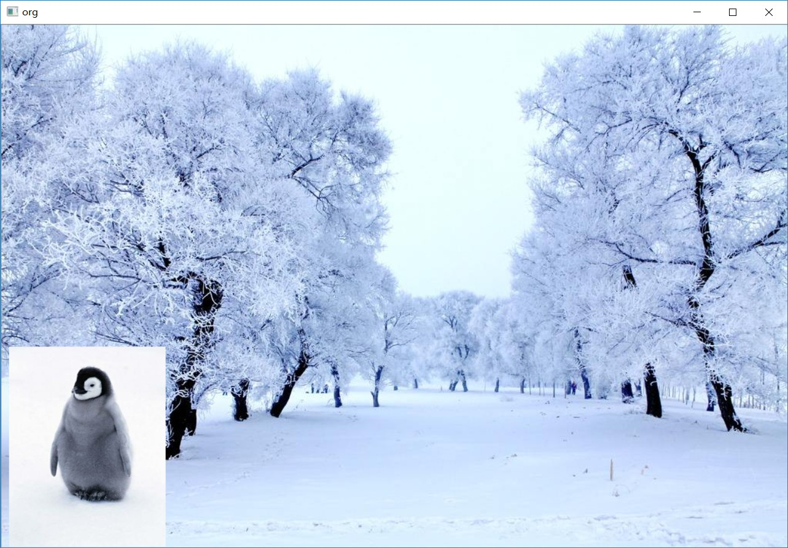
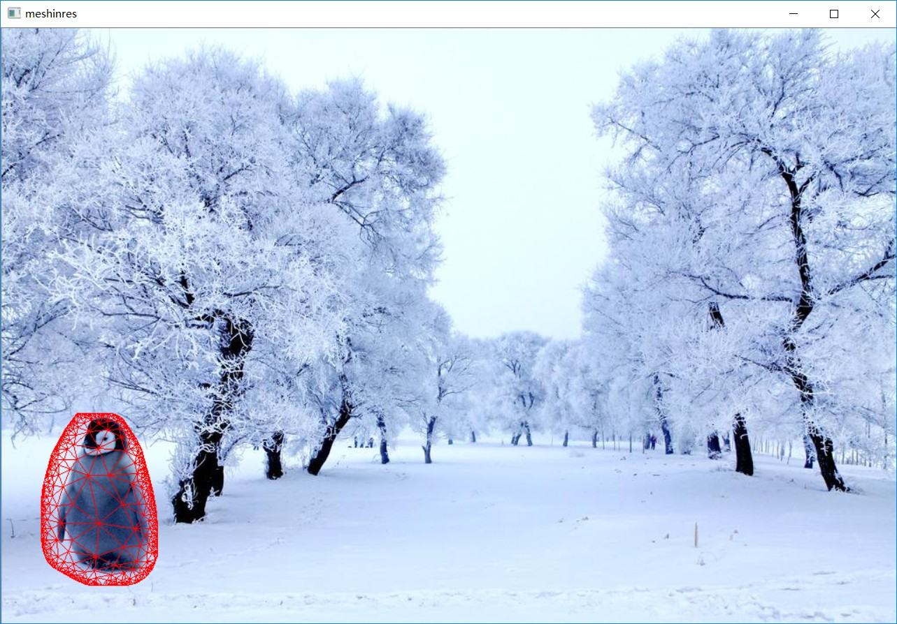
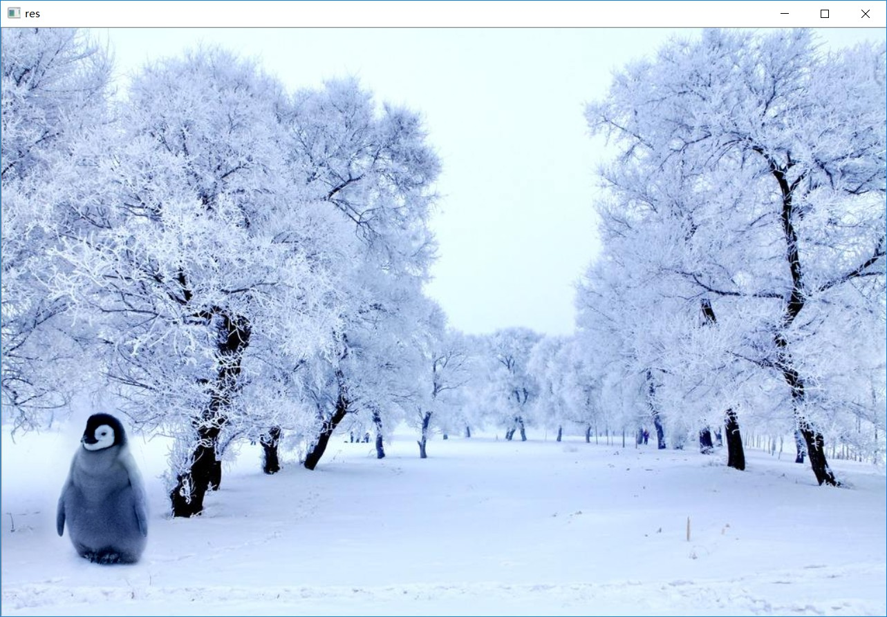

## 0 最终实现效果

三组图例放在/pic 文件夹中

下展示其中一组







## 1 思路与方法

### 1.1 步骤

1.获取source的ROI区域（通过手动勾出）

2.对于src的ROI区域进行三角剖分，建立三角网格mesh

3.对于三角网格每一个顶点计算MVC

4.找到target的对应的边界RGB

5.将三角网格的顶点通过MVC插值得到RGB，再对每个三角内部通过重心插值得到RGB

6.将src处理后放入target图片中

### 1.2 参考

主要参考原论文以及诸多网上资源。

### 1.3 实现

1. 使用opencv来读入保存图片，并获取src的ROI
2. 使用cgal库来获取三角网格
3. 采用重心坐标系来遍历三角内部（以最大边长倒数的一半作为步长即可遍历所有像素）

### 1.4 部分关键代码

#### 1.4.1 main.cpp

```c++
string source = "source-apple2.jpg";
	string border = "border-apple";
	string target = "target-blanket.jpg";

	//getborder(source,border);//获取图像边界
	Cloner c1;
	c1.loadsource(source);//读取src图像到cloner
	//c1.showsource();//显示src图像
	
	c1.getborder(border);//从border文件中读入边界
	//c1.showborder();//在图中显示边界
	c1.getmesh();//获取三角网格
	//c1.showmesh();//显示三角网格
	c1.getcoord("coord");//得到MVC
	cerr << "input orgx orgy:" << endl;
	//c1.loadcoord("coord");//读入MVC
	int orgx, orgy;
	cin >> orgx >> orgy;//放置src在target中的起点
	c1.setOrg(Point(orgx, orgy));//放置
	c1.loadtarget(target);//读入target
	c1.clone();//开始克隆

	c1.showres();//展示克隆最终结果
	c1.showorigin();//展示原始重叠图像
	c1.showmeshinres();//展示网格在最终结果中的样子
```

### 1.4.2 clone.h

#### 1.4.2.1 得到三角网格

调用cgal库如下。

```c++
void getmesh()
	{
		handlevec.clear();
		for (auto e : bordervec)
		{
			handlevec.push_back(Vertex_handle(cdt.insert(Pointcdt(e.x, e.y))));//加入点
		}
		for (int i = 0, size = handlevec.size(); i < size; i++)
		{
			cdt.insert_constraint(handlevec[i], handlevec[(i + 1) % size]);//加入约束边
		}
		std::cerr << "Number of vertices: " << cdt.number_of_vertices() << std::endl;
		std::cerr << "Meshing the triangulation with default criterias..."
			<< std::endl;
		Mesher mesher(cdt);//得到三角网格
		mesher.refine_mesh();
}
```

#### 1.4.2.2 克隆

```c++
//2 get the rgb of the meshpoint of the source
		for (auto face : faces)
		{
			Point *p = face.p;
			//0 put all the mesh points 将网格顶点放入membrane中
			for (int i = 0; i < 3; i++)
			{
				vector<double> &lambda = coords[p[i].y][p[i].x].lambda;
				Vec3f rgb(BLACK);
				for (int j = 0; j < lambda.size(); j++)
				{
					rgb += lambda[j] * (diff[j]);
				}
				PutXY(membrane, p[i], rgb);
				PutXY(check, p[i], RED);
			}
			//next->iner polatino 开始遍历所有三角网格内部节点
			//1 max edge
			double edge = 0;
			for (int i = 0; i < 3; i++)
			{
				Vec2f dis = Vec2f(p[(i + 1) % 3].x - p[i].x, p[(i + 1) % 3].y - p[i].y);
				double tmp = dis.dot(dis);
				if (tmp > edge)
				{
					edge = tmp;
				}
			}
			edge = sqrt(edge);
			//2 traverse 以最大边长倒数的一半作为步长即可遍历所有像素
			double delta = .5 / edge;
			for (double i = 0; i<=1; i += delta)
			{
				for (double j = 0; j<=1 - i; j += delta)
				{
					int x = i * p[0].x + j * p[1].x + (1 - i - j)*p[2].x;
					int y = i * p[0].y + j * p[1].y + (1 - i - j)*p[2].y;
					if (GetRGB(membrane, x, y) == BLACK)
					{
						//3 get interpolation
						Vec3f o[3];
						for (int i = 0; i < 3; i++)
						{
							o[i] = GetVec(p[(i + 1) % 3], p[(i + 2) % 3]);
						}
						double S[3];
						for (int i = 0; i < 3; i++)
						{
							Vec3f tmp = o[i].cross(GetVec(p[(i + 1) % 3], Point(x, y)));
							S[i] = sqrt(tmp.dot(tmp))/2;
						}
						double ALLS = 0;
						for (int i = 0; i < 3; i++)
						{
							ALLS += S[i];
						}
						Vec3f rgb(BLACK);
						for (int i = 0; i < 3; i++)
						{
							rgb += S[i] / ALLS * GetRGB(membrane, p[i]);
						}
					
						PutXY(membrane, Point(x, y), rgb);
						PutXY(check, Point(x,y), RED);
					}
				}
			}
		}
		//5 add the rgb of the membrane to the target
		for (int x = 0; x < sw; x++)
		{
			for (int y = 0; y < sh; y++)
			{
				Vec3f mc = GetRGB(membrane, x, y);
				if(GetRGB(check,x,y)!=BLACK)
				PutXY(tar, ToTarget(Point(x,y)), mc+GetRGB(src,x,y));
			}
		}
		res.copyTo(membrane);
		tar.copyTo(res);
		membrane.copyTo(tar);
	}
```

## 